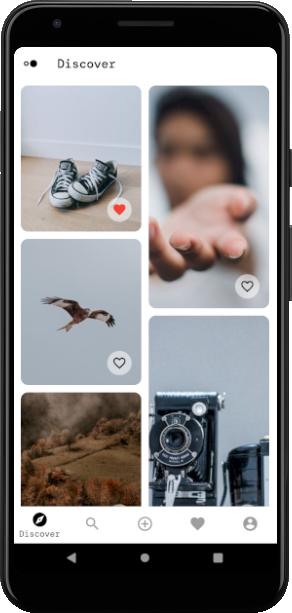
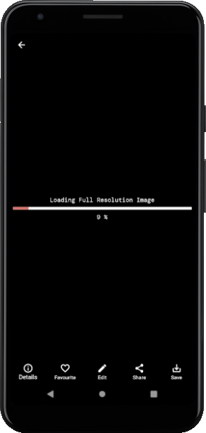
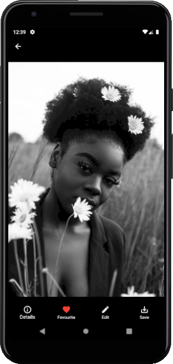
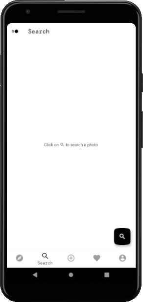
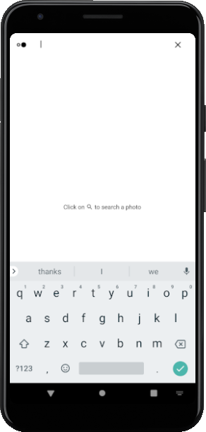
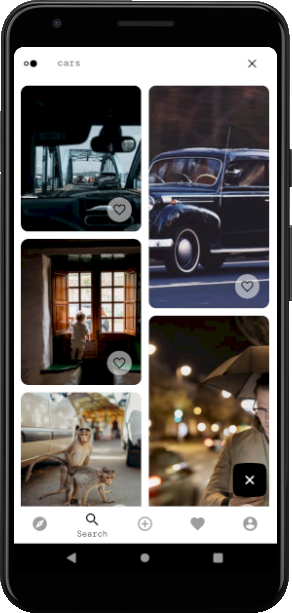
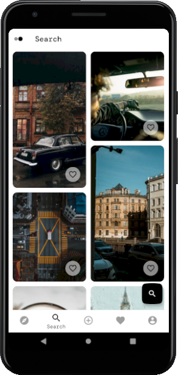

## Quotes Creator App
> A simple app for writing quotes on image for creative writers with built in support for free images. The images are retrieved from Pexels.

### Preview










### Contribution Guide

> This app follows Bloc Patter approch. Read More from [Flutter Bloc](https://bloclibrary.dev/#/architecture "Flutter Bloc")

- After setting up the project please obtain your own Pexel API key from [Pexel API Website](https://www.pexels.com/api/ "Pexel API Website")
- Create a file ```_key.dart``` in ```lib/secrets```
- Add
```dart
String pexelAuthKey = "YOUR_API_KEY";
```
in _key.dart file

### TODOs

- [x] ~~Discover~~
- [x] ~~Search~~
- [ ] Add to Favourites
- [ ] Download Image
- [ ] Edit Image
- [ ] User Profile
